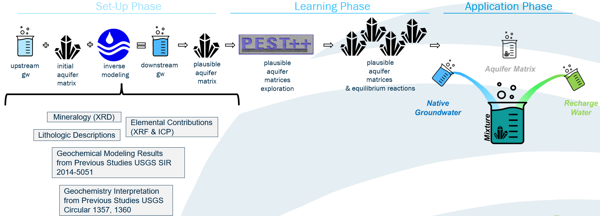

1. install wqtoolkit virtual environment
2. activate environment and cd into folder with workflow.py
3. run the pestpp-ies setup, run, and post-processing with:
	python -X utf8 workflow.py
4. review all output

general concept for the workflow shown in diagram. 

